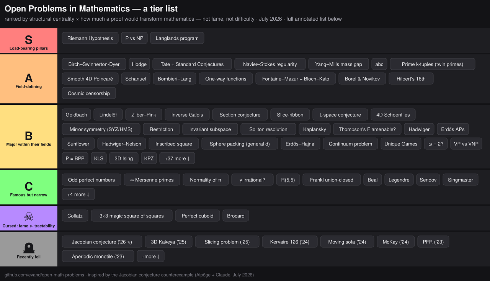

# Open Problems in Mathematics — a tier list

**Ranking axis:** structural centrality × how much a proof would transform mathematics — *not* raw fame, *not* difficulty alone. Fame is a tiebreaker. This is why some household names land surprisingly low.

Inspired by the July 2026 counterexample to the **Jacobian conjecture** (Levent Alpöge + Claude, a 216-character polynomial map ℂ³→ℂ³ with constant Jacobian determinant that is not injective — n ≥ 3 refuted, n = 2 still open; verified across the community within a day of posting). One more reminder that "open" is a temporary condition — see the [graveyard](#-recently-fell-calibration-for-the-whole-list) at the bottom for what "solvable" has looked like lately.

> **Update — August 2026.** Eleven days after this list went up, OpenAI dropped [ten advances in mathematics and theoretical computer science](https://openai.com/index/ten-advances-in-mathematics/) from an internal model ("Astra"), each with a [Lean 4 certificate](https://github.com/openai/ten-proofs) (zero sorries; independent checking via Comparator; journal review still pending). Headline: the **first non-sofic group** — open since Gromov posed soficity in 1999. Also fell: **Connes's rigidity conjecture** (refuted), **Ehrhart's volume conjecture** (proved), and **Erdős problems 183, 146, 180**. Bounds moved on four more fronts: sphere-packing density (upper bounds now reach the Cohn–Elkies threshold), binary/spherical codes (first exponential improvement in the upper bounds since MRRW 1977), the permanent (an n⁴/log n formula lower bound), and GapCVP hardness — plus exponential quantum parallel repetition. Details inline at entries [#59](#combinatorics--graphs), [#65](#combinatorics--graphs), [#78](#theoretical-computer-science) and in the [graveyard](#-recently-fell-calibration-for-the-whole-list). Scorecard for this list: nothing in S or A tier fell; four of the ten are counterexamples, so the [refutation-rate warning](#-recently-fell-calibration-for-the-whole-list) below stands.

**How to read an entry.** Links are marked by favicon, where they exist:

-  Wikipedia — or  arXiv where no decent article exists
-  a formal statement in Lean 4, almost always in Google DeepMind's [formal-conjectures](https://github.com/google-deepmind/formal-conjectures) repo (statements, not proofs!)
-  Manifold prediction markets, usually the "is it *true*?" market — probabilities are snapshots from **July 2026** and will drift
-  Metaculus (search links — their API is login-walled) and other public forecasting or notable expert discussion

Corrections and additions welcome — PRs open. Especially wanted: markets and formalizations that exist but aren't linked here.

---

## S — Load-bearing pillars of mathematics

1. **Riemann Hypothesis (+ GRH for L-functions)** — thousands of theorems are conditional on it; secretly a statement about the "spectrum" of the primes. The one problem on both Hilbert's 1900 list and the Millennium list.
   [ Wikipedia](https://en.wikipedia.org/wiki/Riemann_hypothesis) · [ Lean statement](https://github.com/google-deepmind/formal-conjectures/blob/main/FormalConjectures/Millenium/RiemannHypothesis.lean) (also stated in [ Mathlib](https://leanprover-community.github.io/mathlib4_docs/Mathlib/NumberTheory/LSeries/RiemannZeta.html)) · [ proven or refuted before 2050 — 50%](https://manifold.markets/intiluha/will-riemann-hypothesis-be-proven-o?r=RXZhbkRhbmllbA) · [ if false, how many counterexamples?](https://manifold.markets/ArmandodiMatteo/if-the-riemann-hypothesis-is-false?r=RXZhbkRhbmllbA) · [ AI resolves it before 2035 — 42%](https://manifold.markets/HarrisonLucas/ai-program-resolves-riemann-hypothe?r=RXZhbkRhbmllbA) · [ Metaculus](https://www.metaculus.com/questions/?search=riemann%20hypothesis)
   *Why "is it true?" is a clean binary here, unlike CH:* RH is equivalent to a Π⁰₁ arithmetic sentence — a "this computation never finds a counterexample" statement ([MathOverflow: Is RH equivalent to a Π₁ sentence?](https://mathoverflow.net/questions/31846)). Concretely: RH ⇔ an elementary inequality about σ(n) and harmonic numbers ([Lagarias 2002](https://arxiv.org/abs/math/0008177)), and ⇔ a specific 744-state Turing machine never halting (Matiyasevich–O'Rear–Aaronson, in [Aaronson's Busy Beaver survey, §3](https://www.scottaaronson.com/papers/bb.pdf); see also [the blog post](https://scottaaronson.blog/?p=2725)). For such sentences falsity is always provable — run the machine to the counterexample — so even a ZFC-independence proof would settle the market: independent ⇒ no counterexample ⇒ *true*. Contrast the [CH market](#logic--foundations) below, where "true" is genuinely a philosophy question.
2. **P vs NP** — the only problem here whose answer changes what civilization can do, not just what mathematicians know. Also the deepest: we can't even prove weak circuit lower bounds.
   [ Wikipedia](https://en.wikipedia.org/wiki/P_versus_NP_problem) · [ Lean statement](https://github.com/google-deepmind/formal-conjectures/blob/main/FormalConjectures/Millenium/PvsNP.lean) · [ P = NP? — 8%](https://manifold.markets/IsaacKing/does-p-np?r=RXZhbkRhbmllbA) · [ resolved before humans land on Mars — 37%](https://manifold.markets/warty/will-p-vs-np-be-resolved-before-man?r=RXZhbkRhbmllbA) · [Aaronson's survey](https://www.scottaaronson.com/papers/pnp.pdf) & [Gasarch's polls](https://www.cs.umd.edu/~gasarch/BLOGPAPERS/pollpaper3.pdf) (~80–90% of experts say P ≠ NP)
3. **Langlands functoriality / general reciprocity** — the grand unification of number theory, representation theory, and harmonic analysis. Technically a program, not a problem, but FLT was a corollary of one corner of it. That's the tier it lives in.
   [ Wikipedia](https://en.wikipedia.org/wiki/Langlands_program) · geometric Langlands (function-field analogue) was proven in 2024 ([Gaitsgory–Raskin et al.](https://people.mpim-bonn.mpg.de/gaitsgde/GLC/)) — the arithmetic case is the S-tier monster

## A — Field-defining

4. **Birch–Swinnerton-Dyer** — the bridge between analysis and arithmetic of elliptic curves; rank part and finiteness of Ш both open in general.
   [ Wikipedia](https://en.wikipedia.org/wiki/Birch_and_Swinnerton-Dyer_conjecture) · [ true? — 84%](https://manifold.markets/NcyRocks/is-the-birch-and-swinnertondyer-con?r=RXZhbkRhbmllbA) · [ which Millennium problem falls next?](https://manifold.markets/NcyRocks/which-millennium-prize-problem-will-c4fce2048343?r=RXZhbkRhbmllbA)
5. **Hodge Conjecture** — which topology is algebraic; the health check for all of algebraic geometry.
   [ Wikipedia](https://en.wikipedia.org/wiki/Hodge_conjecture) · [ true? — 80%](https://manifold.markets/NcyRocks/is-the-hodge-conjecture-true?r=RXZhbkRhbmllbA) · [ Litt's $25k bet against a claimed AI-assisted proof — 99%](https://manifold.markets/IsaacKing/will-daniel-litt-win-his-25000-bet?r=RXZhbkRhbmllbA)
6. **Tate Conjecture + Grothendieck's Standard Conjectures** — the motives package; Hodge's arithmetic sibling, arguably more consequential than Hodge itself.
   [ Wikipedia: Tate](https://en.wikipedia.org/wiki/Tate_conjecture) · [ Wikipedia: Standard](https://en.wikipedia.org/wiki/Standard_conjectures_on_algebraic_cycles)
7. **Navier–Stokes global regularity** — do fluids blow up? (Related: interior finite-time singularity for 3D Euler — Hou–Chen's computer-assisted boundary blowup was a landmark.)
   [ Wikipedia](https://en.wikipedia.org/wiki/Navier%E2%80%93Stokes_existence_and_smoothness) · [ Lean statement](https://github.com/google-deepmind/formal-conjectures/blob/main/FormalConjectures/Millenium/NavierStokes.lean) · [ smooth solutions always exist? — 13%](https://manifold.markets/NcyRocks/does-a-smooth-navierstokes-solution?r=RXZhbkRhbmllbA) (Tao suspects blowup) · [ Hutter's $10k bet on a claimed Lean proof — 99% he wins](https://manifold.markets/IsaacKing/will-marcus-hutter-win-his-10000-be?r=RXZhbkRhbmllbA)
8. **Yang–Mills existence & mass gap** — construct a 4D QFT rigorously at all; the gap between physics and math in one problem.
   [ Wikipedia](https://en.wikipedia.org/wiki/Yang%E2%80%93Mills_existence_and_mass_gap) · [ proven ever? — 62%](https://manifold.markets/NcyRocks/will-the-yangmills-existence-and-ma?r=RXZhbkRhbmllbA)
9. **abc Conjecture** — would trivialize half of Diophantine number theory. Status: contested — Mochizuki's IUT claim is not accepted by the broader community (the Scholze–Stix objection stands).
   [ Wikipedia](https://en.wikipedia.org/wiki/Abc_conjecture) · [ Lean statement](https://github.com/google-deepmind/formal-conjectures/blob/main/FormalConjectures/Wikipedia/ABC.lean) · [ true? — 80%](https://manifold.markets/NcyRocks/is-the-abc-conjecture-correct?r=RXZhbkRhbmllbA) · [ Mochizuki's proof has unfixable gaps — 96%](https://manifold.markets/figo/does-shinichi-mochizukis-proof-of-t?r=RXZhbkRhbmllbA)
10. **Hardy–Littlewood prime k-tuples (twin primes as flagship)** — post-Zhang/Maynard we have bounded gaps; the full conjecture is the real prize.
    [ Wikipedia](https://en.wikipedia.org/wiki/Twin_prime) · [ Lean: twin primes](https://github.com/google-deepmind/formal-conjectures/blob/main/FormalConjectures/Wikipedia/TwinPrimes.lean), [ k-tuples](https://github.com/google-deepmind/formal-conjectures/blob/main/FormalConjectures/Wikipedia/HardyLittlewood.lean) · [ infinitely many twin primes? — 95%](https://manifold.markets/NcyRocks/are-there-infinitely-many-twin-prim?r=RXZhbkRhbmllbA) · [ proven before 2030 — 18%](https://manifold.markets/Grothenfla/will-the-twin-prime-conjecture-be-p?r=RXZhbkRhbmllbA)
11. **Smooth 4-dimensional Poincaré Conjecture** — the last Poincaré. Dimension 4 is the lawless frontier of topology.
    [ Wikipedia](https://en.wikipedia.org/wiki/Generalized_Poincar%C3%A9_conjecture) · [ true? — 53%](https://manifold.markets/bordism/is-the-generalized-poincare-conject?r=RXZhbkRhbmllbA) — a genuine coin-flip among topologists
12. **Schanuel's Conjecture** — one statement that subsumes essentially all of transcendence theory (e+π irrational? Corollary.). The most underrated entry on this list.
    [ Wikipedia](https://en.wikipedia.org/wiki/Schanuel%27s_conjecture) · [ Lean statement](https://github.com/google-deepmind/formal-conjectures/blob/main/FormalConjectures/Wikipedia/Schanuel.lean) · [ true? — 77%](https://manifold.markets/PlasmaBallin/is-schanuels-conjecture-true?r=RXZhbkRhbmllbA)
13. **Bombieri–Lang** — geometry governs rational points; the ultimate generalization of Faltings.
    [ Wikipedia](https://en.wikipedia.org/wiki/Bombieri%E2%80%93Lang_conjecture)
14. **Existence of one-way functions** — the foundation of all cryptography; Impagliazzo's five worlds made precise.
    [ Wikipedia](https://en.wikipedia.org/wiki/One-way_function) · [ exist? — 87%](https://manifold.markets/BoltonBailey/do-oneway-functions-exist?r=RXZhbkRhbmllbA) · [ which computational universe do we live in?](https://manifold.markets/JavierPrieto/which-computational-universe-do-we?r=RXZhbkRhbmllbA)
15. **Fontaine–Mazur + Bloch–Kato/Beilinson conjectures** — which Galois representations come from geometry, and what L-values mean. The arithmetic engine room.
    [ Wikipedia: Fontaine–Mazur](https://en.wikipedia.org/wiki/Fontaine%E2%80%93Mazur_conjecture) · [ Wikipedia: Beilinson](https://en.wikipedia.org/wiki/Beilinson_conjectures)
16. **Borel & Novikov Conjectures** — rigidity of aspherical manifolds; where topology, geometry, and operator algebras (Baum–Connes) meet.
    [ Wikipedia: Borel](https://en.wikipedia.org/wiki/Borel_conjecture) · [ Wikipedia: Novikov](https://en.wikipedia.org/wiki/Novikov_conjecture)
17. **Hilbert's 16th problem (second part)** — a uniform bound H(n) on limit cycles of degree-n polynomial vector fields; not even known finite for n = 2. On Hilbert's list *and* Smale's list; the central open problem of dynamical systems. *(new)*
    [ Wikipedia](https://en.wikipedia.org/wiki/Hilbert%27s_sixteenth_problem)
18. **Cosmic censorship (weak & strong)** — are naked singularities generic? Is determinism salvageable in GR? The organizing conjectures of mathematical relativity; strong censorship (C⁰ version) already dented by Dafermos–Luk. Kerr stability only recently settled for slow rotation. *(new)*
    [ Wikipedia](https://en.wikipedia.org/wiki/Cosmic_censorship_hypothesis) · famously the subject of [ Thorne–Hawking–Preskill bets](https://en.wikipedia.org/wiki/Thorne%E2%80%93Hawking%E2%80%93Preskill_bet)

## B — Major open problems within their fields

### Number theory

19. **Goldbach (binary)** — famous and genuinely important, but a proof likely refines circle-method tech rather than creating a new world. Ternary case: done (Helfgott).
    [ Wikipedia](https://en.wikipedia.org/wiki/Goldbach%27s_conjecture) · [ Lean statement](https://github.com/google-deepmind/formal-conjectures/blob/main/FormalConjectures/Wikipedia/GoldbachConjecture.lean) · [ true? — 92%](https://manifold.markets/NcyRocks/is-goldbachs-conjecture-correct?r=RXZhbkRhbmllbA) · [ proved before 2040 — 44%](https://manifold.markets/Elspeth/will-goldbachs-conjecture-be-proved-ac8ca9f27148?r=RXZhbkRhbmllbA)
20. **Lindelöf Hypothesis** — RH's understudy; even this is out of reach.
    [ Wikipedia](https://en.wikipedia.org/wiki/Lindel%C3%B6f_hypothesis)
21. **Elliott–Halberstam** — primes in progressions beyond GRH; would give prime gaps ≤ 6 (Polymath8b).
    [ Wikipedia](https://en.wikipedia.org/wiki/Elliott%E2%80%93Halberstam_conjecture) · [ Lean statement](https://github.com/google-deepmind/formal-conjectures/blob/main/FormalConjectures/Wikipedia/ElliottHalberstamConjecture.lean)
22. **Chowla & Sarnak conjectures** — Möbius randomness; Tao's logarithmic results are the beachhead.
    [ Wikipedia](https://en.wikipedia.org/wiki/Liouville_function)
23. **Are elliptic curve ranks unbounded?** — heuristics now say bounded (!), reversing decades of folklore.
    [ Wikipedia](https://en.wikipedia.org/wiki/Rank_of_an_elliptic_curve) · [ Lean statement](https://github.com/google-deepmind/formal-conjectures/blob/main/FormalConjectures/Wikipedia/EllipticCurveRank.lean)
24. **Hilbert's 12th (explicit class field theory)** — real recent progress (Dasgupta–Kakde), still open.
    [ Wikipedia](https://en.wikipedia.org/wiki/Hilbert%27s_twelfth_problem)
25. **Hilbert's 10th over ℚ** — is there an algorithm for rational points? (Over ℤ: no — MRDP. Over ℚ: open; over some big rings recently resolved.)
    [ Wikipedia](https://en.wikipedia.org/wiki/Hilbert%27s_tenth_problem)
26. **Inverse Galois Problem** — is every finite group a Galois group over ℚ?
    [ Wikipedia](https://en.wikipedia.org/wiki/Inverse_Galois_problem) · [ Lean statement](https://github.com/google-deepmind/formal-conjectures/blob/main/FormalConjectures/Wikipedia/InverseGalois.lean)
27. **Artin's primitive root conjecture** — follows from GRH; unconditional = open.
    [ Wikipedia](https://en.wikipedia.org/wiki/Artin%27s_conjecture_on_primitive_roots) · [ Lean statement](https://github.com/google-deepmind/formal-conjectures/blob/main/FormalConjectures/Wikipedia/ArtinPrimitiveRootsConjecture.lean)
28. **Lehmer's Mahler measure problem** — a spectral gap for algebraic numbers.
    [ Wikipedia](https://en.wikipedia.org/wiki/Lehmer%27s_conjecture) · [ Lean statement](https://github.com/google-deepmind/formal-conjectures/blob/main/FormalConjectures/Wikipedia/LehmerMahlerMeasureProblem.lean)
29. **Littlewood Conjecture (simultaneous approximation)** — exceptions have measure zero (Einsiedler–Katok–Lindenstrauss); full statement open.
    [ Wikipedia](https://en.wikipedia.org/wiki/Littlewood_conjecture) · [ Lean statement](https://github.com/google-deepmind/formal-conjectures/blob/main/FormalConjectures/Wikipedia/LittlewoodConjecture.lean)
30. **Zilber–Pink** — the unlikely-intersections master conjecture (André–Oort was its solved special case).
    [ Wikipedia](https://en.wikipedia.org/wiki/Zilber%E2%80%93Pink_conjecture)
31. **Serre's uniformity question** — Galois images of elliptic curves over ℚ: is 37 the last exceptional prime?
    [ Wikipedia](https://en.wikipedia.org/wiki/Galois_representation)
32. **Vandiver / Leopoldt** — old, stubborn, structurally meaningful.
    [ Wikipedia: Vandiver](https://en.wikipedia.org/wiki/Kummer%E2%80%93Vandiver_conjecture) · [ Wikipedia: Leopoldt](https://en.wikipedia.org/wiki/Leopoldt%27s_conjecture) · [ Lean: Vandiver](https://github.com/google-deepmind/formal-conjectures/blob/main/FormalConjectures/Wikipedia/KummerVandiver.lean)
33. **Grothendieck's section conjecture** — anabelian geometry's central open question: rational points = sections of the fundamental exact sequence. *(new)*
    [ Wikipedia](https://en.wikipedia.org/wiki/Section_conjecture)
34. **Selberg's 1/4 eigenvalue conjecture / Ramanujan–Petersson for Maass forms** — the archimedean edge of Langlands; everything in analytic number theory wants it. *(new)*
    [ Wikipedia](https://en.wikipedia.org/wiki/Selberg%27s_1/4_conjecture)

### Geometry & topology

35. **Slice-ribbon conjecture** — knot concordance's central mystery (the Conway knot episode was a warning shot).
    [ Wikipedia](https://en.wikipedia.org/wiki/Slice-ribbon_conjecture)
36. **L-space conjecture** — the conjectural trinity (Floer homology / taut foliations / left-orderability) of 3-manifolds.
    [ arXiv](https://arxiv.org/abs/1107.5016)
37. **4D Schoenflies** — even more embarrassing than smooth Poincaré, arguably.
    [ Wikipedia](https://en.wikipedia.org/wiki/Schoenflies_problem)
38. **Volume Conjecture** — quantum invariants see hyperbolic geometry.
    [ Wikipedia](https://en.wikipedia.org/wiki/Volume_conjecture)
39. **Cannon Conjecture** — group theory determines when a boundary is a sphere.
    [ Wikipedia](https://en.wikipedia.org/wiki/Cannon%27s_conjecture)
40. **Hopf conjectures** — positive curvature on S²×S²; sign of the Euler characteristic.
    [ Wikipedia](https://en.wikipedia.org/wiki/Hopf_conjecture)
41. **Andrews–Curtis** — widely suspected false; a disproof would be spectacular.
    [ Wikipedia](https://en.wikipedia.org/wiki/Andrews%E2%80%93Curtis_conjecture)
42. **Whitehead asphericity** — 80+ years, elementary statement, nothing.
    [ Wikipedia](https://en.wikipedia.org/wiki/Whitehead_conjecture)
43. **SYZ conjecture & homological mirror symmetry** — *why* mirror symmetry works; proved in families of examples, open as a general principle. *(new)*
    [ Wikipedia: SYZ](https://en.wikipedia.org/wiki/SYZ_conjecture) · [ Wikipedia: HMS](https://en.wikipedia.org/wiki/Homological_mirror_symmetry)

### Analysis & dynamics

44. **Restriction Conjecture** — the summit of harmonic analysis; Kakeya was its foothill (3D Kakeya fell in 2025 — Wang–Zahl; higher dimensions and restriction itself open).
    [ Wikipedia](https://en.wikipedia.org/wiki/Restriction_conjecture)
45. **Falconer distance conjecture** — fractal geometry's flagship.
    [ Wikipedia](https://en.wikipedia.org/wiki/Falconer%27s_conjecture)
46. **Invariant subspace problem (Hilbert space)** — Enflo's 2023 claim remains unaccepted; cursed energy.
    [ Wikipedia](https://en.wikipedia.org/wiki/Invariant_subspace_problem) · [ Lean statement](https://github.com/google-deepmind/formal-conjectures/blob/main/FormalConjectures/Wikipedia/InvariantSubspaceProblem.lean)
47. **Crouzeix's conjecture** — the constant is 2, everyone believes it, nobody can do it.
    [ Wikipedia](https://en.wikipedia.org/wiki/Crouzeix%27s_conjecture)
48. **Fuglede-type spectral questions in low dimensions** — false in general (Tao), alive in ℝ², ℝ³ (the conjecture *was* fully proved for convex domains).
    [ Wikipedia](https://en.wikipedia.org/wiki/Fuglede%27s_conjecture) · [ Lean statement](https://github.com/google-deepmind/formal-conjectures/blob/main/FormalConjectures/Wikipedia/Fuglede.lean)
49. **Furstenberg's ×2, ×3 measure conjecture** — rigidity of arithmetic dynamics; Rudolph's theorem is the partial result everyone wants to remove the entropy hypothesis from.
    [ Wikipedia](https://en.wikipedia.org/wiki/Hillel_Furstenberg)
50. **Soliton resolution conjecture** — every reasonable dispersive evolution decomposes into solitons + radiation; proved for energy-critical waves in special cases (Duyckaerts–Kenig–Merle), wide open in general. *(new)*
    [ Wikipedia](https://en.wikipedia.org/wiki/Soliton)
51. **Quantum unique ergodicity** — arithmetic case is a Fields-medal theorem (Lindenstrauss); general negatively-curved manifolds open. *(new)*
    [ Wikipedia](https://en.wikipedia.org/wiki/Quantum_ergodicity)

### Algebra

52. **Kaplansky zero-divisor & idempotent conjectures** — especially spicy since the unit conjecture was refuted (Gardam, 2021).
    [ Wikipedia](https://en.wikipedia.org/wiki/Kaplansky%27s_conjectures) · [ Lean statement](https://github.com/google-deepmind/formal-conjectures/blob/main/FormalConjectures/Wikipedia/Kaplansky.lean)
53. **Köthe Conjecture** — ring theory's oldest open wound (1930).
    [ Wikipedia](https://en.wikipedia.org/wiki/K%C3%B6the_conjecture) · [ Lean statement](https://github.com/google-deepmind/formal-conjectures/blob/main/FormalConjectures/Wikipedia/Koethe.lean)
54. **Alperin weight & Broué's abelian defect conjectures** — modular representation theory's core (McKay itself fell in '24, Brauer's height zero in '24 too — the local-global program is on a run).
    [ Wikipedia](https://en.wikipedia.org/wiki/J._L._Alperin) · [ Wikipedia: Broué](https://en.wikipedia.org/wiki/Michel_Brou%C3%A9)
55. **Brauer's remaining problems on blocks and characters** — the 1963 list that keeps giving.
    [ Wikipedia](https://en.wikipedia.org/wiki/Modular_representation_theory)
56. **Is Thompson's group F amenable?** — the most contested question in geometric group theory; multiple contradictory claimed proofs *in both directions* have died. *(new)*
    [ Wikipedia](https://en.wikipedia.org/wiki/Thompson_groups)

### Combinatorics & graphs

57. **Hadwiger's Conjecture (graph minors vs. coloring)** — the deepest thing in graph theory.
    [ Wikipedia](https://en.wikipedia.org/wiki/Hadwiger_conjecture_%28graph_theory%29) · [ true? — 58%](https://manifold.markets/Pazzaz/is-hadwigers-conjecture-true?r=RXZhbkRhbmllbA)
58. **Erdős's conjecture on APs in sets of divergent reciprocal sum** — Bloom–Sisask did density; full conjecture (primes ⇒ Green–Tao as corollary) open.
    [ Wikipedia](https://en.wikipedia.org/wiki/Erd%C5%91s_conjecture_on_arithmetic_progressions) · [ true? — 88%](https://manifold.markets/wylderai/is-the-erdos-conjecture-on-arithmet?r=RXZhbkRhbmllbA) · [ LLM finds counterexample by 7/2027 — 8%](https://manifold.markets/Bayesian/will-an-llm-find-a-counterexample-t?r=RXZhbkRhbmllbA)
59. **Diagonal Ramsey asymptotics** — the exponential barrier finally cracked (Campos–Griffiths–Morris–Sahasrabudhe 2023); true growth rate still open. *Aug 2026:* the **multicolor triangle** cousin fell — Astra's superexponential lower bound for R(3;k) settled [Erdős #183](https://www.erdosproblems.com/183); the two-color diagonal rate is untouched.
    [ Wikipedia](https://en.wikipedia.org/wiki/Ramsey%27s_theorem)
60. **Sunflower Conjecture** — big progress (Alweiss–Lovett–Wu–Zhang 2019), gap remains.
    [ Wikipedia](https://en.wikipedia.org/wiki/Sunflower_%28mathematics%29) · [ Lean statement](https://github.com/google-deepmind/formal-conjectures/blob/main/FormalConjectures/Wikipedia/ErdosRadoSunflowerConjecture.lean) · [ true? — 73%](https://manifold.markets/PlasmaBallin/is-the-sunflower-conjecture-true?r=RXZhbkRhbmllbA)
61. **Reconstruction Conjecture** — can you rebuild a graph from its vertex-deleted deck?
    [ Wikipedia](https://en.wikipedia.org/wiki/Reconstruction_conjecture)
62. **Cycle double cover / Berge–Fulkerson / Tutte's flow conjectures** — the snark-infested waters.
    [ Wikipedia: CDC](https://en.wikipedia.org/wiki/Cycle_double_cover) · [ Wikipedia: flows](https://en.wikipedia.org/wiki/Nowhere-zero_flow)
63. **Hadwiger–Nelson (chromatic number of the plane)** — now 5 ≤ χ ≤ 7 thanks to a hobbyist (de Grey, 2018).
    [ Wikipedia](https://en.wikipedia.org/wiki/Hadwiger%E2%80%93Nelson_problem) · [ Lean statement](https://github.com/google-deepmind/formal-conjectures/blob/main/FormalConjectures/Wikipedia/HadwigerNelson.lean) · [ what is χ?](https://manifold.markets/BoltonBailey/what-is-the-solution-to-the-hadwige?r=RXZhbkRhbmllbA)
64. **Inscribed square (Toeplitz)** — every Jordan curve? Smooth case done; continuous case open since 1911.
    [ Wikipedia](https://en.wikipedia.org/wiki/Inscribed_square_problem) · [ Lean statement](https://github.com/google-deepmind/formal-conjectures/blob/main/FormalConjectures/Wikipedia/InscribedSquare.lean) · [ true? — 80%](https://manifold.markets/PlasmaBallin/is-toeplitzs-conjecture-inscribed-s?r=RXZhbkRhbmllbA)
65. **Sphere packing / kissing numbers in general dimension** — 8 and 24 fell to Viazovska; everything else is wilderness (and dim 10+ lower bounds just moved for the first time in decades). *Aug 2026:* the wilderness is shrinking from above too — Astra pushed the asymptotic **upper** bounds down to the Cohn–Elkies linear-programming threshold, and beat the 1977 MRRW upper bounds for binary codes exponentially at every minimum distance ([Lean certificates](https://github.com/openai/ten-proofs)). The true asymptotic density remains open.
    [ Wikipedia](https://en.wikipedia.org/wiki/Sphere_packing) · [ Wikipedia: kissing](https://en.wikipedia.org/wiki/Kissing_number)
66. **Caccetta–Häggkvist** — digraph girth; simple statement, no traction.
    [ arXiv](https://arxiv.org/abs/math/0605646)
67. **Erdős–Hajnal conjecture** — forbidding any one induced subgraph forces polynomial-size cliques or independent sets; structural graph theory's north star. *(new)*
    [ Wikipedia](https://en.wikipedia.org/wiki/Erd%C5%91s%E2%80%93Hajnal_conjecture)
68. **Sidorenko's conjecture** — bipartite graphs are "quasirandomness-minimal"; deceptively innocent, tied to Gowers norms and graph limits. *(new)*
    [ Wikipedia](https://en.wikipedia.org/wiki/Sidorenko%27s_conjecture) · [ Lean statement](https://github.com/google-deepmind/formal-conjectures/blob/main/FormalConjectures/Wikipedia/SidorenkoConjecture.lean)
69. **Hadamard matrix conjecture** — a Hadamard matrix in every order 4k; smallest open order 668. *(new)*
    [ Wikipedia](https://en.wikipedia.org/wiki/Hadamard_matrix) · [ Lean statement](https://github.com/google-deepmind/formal-conjectures/blob/main/FormalConjectures/Wikipedia/Hadamard.lean)
70. **Erdős–Turán conjecture on additive bases** — must representation counts of an additive basis be unbounded? *(new)*
    [ Wikipedia](https://en.wikipedia.org/wiki/Erd%C5%91s%E2%80%93Tur%C3%A1n_conjecture_on_additive_bases)

### Logic & foundations

71. **The Continuum Problem, post-Cohen** — independence didn't kill it: Woodin's Ultimate-L vs. the forcing-axiom camp (which says 2^ℵ⁰ = ℵ₂!) make it a live research program about which axioms are *true*.
    [ Wikipedia](https://en.wikipedia.org/wiki/Continuum_hypothesis) · [ is CH true? — 61%](https://manifold.markets/PlasmaBallin/is-the-continuum-hypothesis-true?r=RXZhbkRhbmllbA) (a market on a statement independent of ZFC is itself a philosophy experiment)
72. **Vaught's Conjecture** — model theory's white whale.
    [ Wikipedia](https://en.wikipedia.org/wiki/Vaught_conjecture) · [ Lean statement](https://github.com/google-deepmind/formal-conjectures/blob/main/FormalConjectures/Wikipedia/VaughtConjecture.lean)

### Theoretical computer science

73. **Unique Games Conjecture** — half-proved (2-to-2 games); would settle optimal inapproximability across the board.
    [ Wikipedia](https://en.wikipedia.org/wiki/Unique_games_conjecture) · [ true? — 65%](https://manifold.markets/Floffinou/is-the-unique-games-conjecture-true?r=RXZhbkRhbmllbA)
74. **Matrix multiplication exponent ω = 2?** — inching down for 50 years; current record ω < 2.3714.
    [ Wikipedia](https://en.wikipedia.org/wiki/Computational_complexity_of_matrix_multiplication) · [ beat 2.371552 before 2035 — 99%](https://manifold.markets/Widden/will-a-matmul-algorithm-better-than?r=RXZhbkRhbmllbA)
75. **P = BPP (derandomization)** — everyone believes it; a proof requires circuit lower bounds we can't touch.
    [ Wikipedia](https://en.wikipedia.org/wiki/BPP_%28complexity%29)
76. **Graph isomorphism in P?** — Babai got quasipolynomial; the last step is stuck.
    [ Wikipedia](https://en.wikipedia.org/wiki/Graph_isomorphism_problem) · [ in P? — 51%](https://manifold.markets/BoltonBailey/is-graph-isomorphism-in-p?r=RXZhbkRhbmllbA) · [ NP-complete? — 7%](https://manifold.markets/BoltonBailey/is-graph-isomorphism-npcomplete?r=RXZhbkRhbmllbA)
77. **Log-rank conjecture** — communication complexity's oldest embarrassment.
    [ Wikipedia](https://en.wikipedia.org/wiki/Log-rank_conjecture)
78. **VP vs VNP (Valiant's hypothesis)** — permanent vs. determinant; the algebraic P vs NP, plausibly easier. No longer quite "untouched": Astra's n⁴/log n arithmetic-formula lower bound for the permanent (Aug 2026, [Lean-certified](https://github.com/openai/ten-proofs)) is the first real movement in decades — though still astronomically far from the superpolynomial bounds VP ≠ VNP needs.
    [ Wikipedia](https://en.wikipedia.org/wiki/Computing_the_permanent)
79. **Quantum PCP conjecture** — hardness of approximating ground-state energy; the NLTS breakthrough (2022) was the first real step. *(new)*
    [ Wikipedia](https://en.wikipedia.org/wiki/Quantum_PCP_conjecture)

### Probability, mathematical physics & high-dimensional geometry

80. **3D Ising / percolation critical exponents & conformal invariance** — 2D is a triumph (SLE); 3D is a desert with physics predictions (bootstrap!) and no proofs.
    [ Wikipedia](https://en.wikipedia.org/wiki/Ising_critical_exponents)
81. **KPZ universality in full generality** — proved for exactly solvable models only.
    [ Wikipedia](https://en.wikipedia.org/wiki/Kardar%E2%80%93Parisi%E2%80%93Zhang_equation)
82. **Ergodic/quantitative theory of turbulence** — beyond even Navier–Stokes regularity. (Meanwhile Hilbert's *6th* — deriving fluid equations from Newtonian particles — took a giant leap with Deng–Hani–Ma 2025.)
    [ Wikipedia](https://en.wikipedia.org/wiki/Turbulence)
83. **Kannan–Lovász–Simonovits (KLS) conjecture** — one spectral constant governing isoperimetry of all log-concave measures; Yuansi Chen's 2020 near-resolution electrified the field, the constant-factor question remains. *(new)*
    [ arXiv](https://arxiv.org/abs/1807.03465)
84. **Mahler volume conjecture** — cubes minimize the volume product; proved in ℝ³ (2020), open in general. Symplectic connection: it followed from Viterbo's conjecture — which was just refuted, so the route died but the conjecture didn't. *(new)*
    [ Wikipedia](https://en.wikipedia.org/wiki/Mahler_volume)

## C — Famous, but narrow or technique-isolated

85. **Odd perfect numbers** — open for ~2300 years, the oldest problem in mathematics. A proof would be a fireworks show, not an earthquake.
    [ Wikipedia](https://en.wikipedia.org/wiki/Perfect_number) · [ Lean statement](https://github.com/google-deepmind/formal-conjectures/blob/main/FormalConjectures/Wikipedia/PerfectNumbers.lean) · [ exist? — 9%](https://manifold.markets/NcyRocks/are-there-any-odd-perfect-numbers?r=RXZhbkRhbmllbA)
86. **Infinitely many Mersenne primes (and: finitely many Fermat primes?)** — no tools exist. None.
    [ Wikipedia](https://en.wikipedia.org/wiki/Mersenne_prime) · [ Lean statement](https://github.com/google-deepmind/formal-conjectures/blob/main/FormalConjectures/Wikipedia/Mersenne.lean) · [ infinitely many? — 89%](https://manifold.markets/PlasmaBallin/are-there-infinitely-many-mersenne?r=RXZhbkRhbmllbA) · [ new Mersenne prime found in 2026 — 16%](https://manifold.markets/Neupherium/will-a-new-mersenne-prime-be-found?r=RXZhbkRhbmllbA)
87. **Normality of π, e, √2** — we cannot prove a single natural constant is normal. Humbling, isolated.
    [ Wikipedia](https://en.wikipedia.org/wiki/Normal_number) · [ Lean statement](https://github.com/google-deepmind/formal-conjectures/blob/main/FormalConjectures/Wikipedia/NormalityOfPi.lean)
88. **Irrationality of γ (Euler–Mascheroni) and ζ(5)** — ζ(3) took Apéry magic; the magic didn't generalize.
    [ Wikipedia](https://en.wikipedia.org/wiki/Euler%27s_constant) · [ Lean statement](https://github.com/google-deepmind/formal-conjectures/blob/main/FormalConjectures/Wikipedia/RiemannZetaValues.lean)
89. **Lehmer's totient problem** — does φ(n) | n−1 force primality?
    [ Wikipedia](https://en.wikipedia.org/wiki/Lehmer%27s_totient_problem) · [ Lean statement](https://github.com/google-deepmind/formal-conjectures/blob/main/FormalConjectures/Wikipedia/LehmerTotient.lean) · [ composite solution exists? — 30%](https://manifold.markets/PlasmaBallin/lehmers-totient-problem-is-there-a?r=RXZhbkRhbmllbA)
90. **Ramsey number R(5,5)** — known to be in [43, 46]; finite computation, cosmically infeasible. ("Aliens demand R(6,6): attack." — Erdős)
    [ Wikipedia](https://en.wikipedia.org/wiki/Ramsey%27s_theorem) · [ Lean statement](https://github.com/google-deepmind/formal-conjectures/blob/main/FormalConjectures/Wikipedia/RamseyNumbers.lean) · [ known before 2040 — 71%](https://manifold.markets/IsaacKing/will-the-5-5-ramsey-number-by-known?r=RXZhbkRhbmllbA) · [ its value?](https://manifold.markets/lisamarsh/what-is-the-value-of-the-ramsey-num?r=RXZhbkRhbmllbA)
91. **Union-closed sets (Frankl)** — Gilmer's 2022 breakthrough got a constant (now ≈ 0.38); the ½ remains.
    [ Wikipedia](https://en.wikipedia.org/wiki/Union-closed_sets_conjecture) · [ Lean statement](https://github.com/google-deepmind/formal-conjectures/blob/main/FormalConjectures/Wikipedia/UnionClosed.lean) · [ true? — 78%](https://manifold.markets/PlasmaBallin/is-the-unionclosed-sets-conjecture?r=RXZhbkRhbmllbA)
92. **Second neighborhood conjecture, graceful trees, lonely runner** — beloved, bounded blast radius.
    [ Wikipedia: 2nd nbhd](https://en.wikipedia.org/wiki/Second_neighborhood_problem) · [ Wikipedia: graceful](https://en.wikipedia.org/wiki/Graceful_labeling) · [ Wikipedia: lonely runner](https://en.wikipedia.org/wiki/Lonely_runner_conjecture) · [ Lean: graceful](https://github.com/google-deepmind/formal-conjectures/blob/main/FormalConjectures/Wikipedia/GracefulLabeling.lean), [ lonely runner](https://github.com/google-deepmind/formal-conjectures/blob/main/FormalConjectures/Wikipedia/LonelyRunnerConjecture.lean)
93. **Zaremba's conjecture** — continued fractions with bounded partial quotients; Bourgain–Kontorovich got density one.
    [ Wikipedia](https://en.wikipedia.org/wiki/Zaremba%27s_conjecture)
94. **Erdős–Straus (4/n = 1/x + 1/y + 1/z)** — the classic "looks like homework, isn't."
    [ Wikipedia](https://en.wikipedia.org/wiki/Erd%C5%91s%E2%80%93Straus_conjecture)
95. **Legendre's conjecture & Landau's n²+1 problem** — the two Landau problems with zero movement since 1912 (his other two are Goldbach and twin primes, above). *(new)*
    [ Wikipedia: Legendre](https://en.wikipedia.org/wiki/Legendre%27s_conjecture) · [ Wikipedia: Landau's problems](https://en.wikipedia.org/wiki/Landau%27s_problems) · [ Lean statement](https://github.com/google-deepmind/formal-conjectures/blob/main/FormalConjectures/Wikipedia/LegendreConjecture.lean) · [ which Landau problem falls next?](https://manifold.markets/PlasmaBallin/which-of-landaus-problems-will-be-s?r=RXZhbkRhbmllbA)
96. **Beal conjecture** — Fermat with mixed exponents and a $1M bounty from a Texas banker. *(new)*
    [ Wikipedia](https://en.wikipedia.org/wiki/Beal_conjecture) · [ Lean statement](https://github.com/google-deepmind/formal-conjectures/blob/main/FormalConjectures/Wikipedia/BealConjecture.lean) · [ true? — 59%](https://manifold.markets/PlasmaBallin/is-beals-conjecture-true?r=RXZhbkRhbmllbA)
97. **Sendov's conjecture** — zeros and critical points of polynomials in a disk; Tao settled it for sufficiently high degree, the rest is open. *(new)*
    [ Wikipedia](https://en.wikipedia.org/wiki/Sendov%27s_conjecture) · [ Lean statement](https://github.com/google-deepmind/formal-conjectures/blob/main/FormalConjectures/Wikipedia/Sendov.lean)
98. **Singmaster's conjecture** — does any number appear more than 8 times in Pascal's triangle? *(new)*
    [ Wikipedia](https://en.wikipedia.org/wiki/Singmaster%27s_conjecture) · [ Lean statement](https://github.com/google-deepmind/formal-conjectures/blob/main/FormalConjectures/Wikipedia/Singmaster.lean)

## ☠️ Cursed tier (fame ≫ tractability; possibly technique-free)

99. **Collatz** — "Mathematics is not ready for such problems" (Erdős). Tao's almost-everywhere result is the best in 80 years and it's still nowhere near. Maximal fame, unclear payoff, no attack surface. Its own tier.
    [ Wikipedia](https://en.wikipedia.org/wiki/Collatz_conjecture) · [ Lean statement](https://github.com/google-deepmind/formal-conjectures/blob/main/FormalConjectures/Wikipedia/CollatzConjecture.lean) · [ true? — 82%](https://manifold.markets/NcyRocks/is-the-collatz-conjecture-true?r=RXZhbkRhbmllbA) · [ resolved before 2030 — 14%](https://manifold.markets/AlunStokes/will-the-collatz-conjecture-be-reso?r=RXZhbkRhbmllbA)
100. **3×3 magic square of squares** — recreational statement, absorbs infinite amateur-hours (a.k.a. the Parker Square problem).
     [ Wikipedia](https://en.wikipedia.org/wiki/Magic_square) · [ Lean statement](https://github.com/google-deepmind/formal-conjectures/blob/main/FormalConjectures/Wikipedia/MagicSquares.lean) · [ which year is one found?](https://manifold.markets/strutheo/in-what-year-will-we-discover-a-3x3?r=RXZhbkRhbmllbA) · [ proven impossible by 2025 — resolved NO](https://manifold.markets/Conflux/will-a-3x3-magic-square-of-distinct?r=RXZhbkRhbmllbA)
101. **Perfect cuboid** — same energy, 300 years running.
     [ Wikipedia](https://en.wikipedia.org/wiki/Euler_brick) · [ Lean statement](https://github.com/google-deepmind/formal-conjectures/blob/main/FormalConjectures/Wikipedia/EulerBrick.lean)
102. **Brocard's problem (n! + 1 = m²)** — three known solutions, no theory.
     [ Wikipedia](https://en.wikipedia.org/wiki/Brocard%27s_problem) · [ Lean statement](https://github.com/google-deepmind/formal-conjectures/blob/main/FormalConjectures/Wikipedia/BrocardProblem.lean)

## 🪦 Recently fell (calibration for the whole list)

For a sense of what "solvable" looks like lately:

- **The Astra batch** — [ten results at once](https://openai.com/index/ten-advances-in-mathematics/) (OpenAI, August 2026), every one with a [Lean 4 certificate](https://github.com/openai/ten-proofs), zero sorries; informally reviewed, journal review pending. The kills: **existence of a non-sofic group** (Gromov's question, open since 1999 — settled by *construction*, i.e. "all groups are sofic" refuted), **Connes's rigidity conjecture** — *refuted*, **Ehrhart's volume conjecture** — proved (sharp maximal volume in every dimension for a convex body whose centroid is its only interior lattice point), [**Erdős #183**](https://www.erdosproblems.com/183) — superexponential multicolor triangle Ramsey lower bound, and the **compactness ([Erdős #146](https://www.erdosproblems.com/146)) and degeneracy ([Erdős #180](https://www.erdosproblems.com/180)) conjectures** in extremal graph theory — both *refuted*. The bound-movers (sphere packing, binary codes, permanent, GapCVP, quantum parallel repetition) are annotated inline above. Four of the ten are counterexamples — the tally below keeps growing on schedule.
- **Jacobian conjecture** — *refuted* for n ≥ 3 by a 216-character map ℂ³→ℂ³ ([ Alpöge](https://en.wikipedia.org/wiki/Jacobian_conjecture) + Claude, July 2026; simple enough to check in a CAS, verified community-wide within a day). The great graveyard of false *proofs* ends up dead by *counterexample*. The n = 2 case is still open — [ true in 2D? — 39%](https://manifold.markets/wingspan/is-the-jacobian-conjecture-true-in?r=RXZhbkRhbmllbA) · [ general, pre-refutation market — 1%](https://manifold.markets/IsaacKing/is-the-jacobian-conjecture-true?r=RXZhbkRhbmllbA) · [ Lean statement](https://github.com/google-deepmind/formal-conjectures/blob/main/FormalConjectures/Wikipedia/JacobianConjecture.lean). Bonus casualty: via Tsuchimoto / Belov-Kanel–Kontsevich equivalences, trouble propagates to the Dixmier conjecture for Weyl algebras.
- **Bourgain's slicing problem / hyperplane conjecture** — Klartag–Lehec '25, pending review
- **Moving sofa problem** — Baek '24, pending review ([ Wikipedia](https://en.wikipedia.org/wiki/Moving_sofa_problem)) — [ Lean statement](https://github.com/google-deepmind/formal-conjectures/blob/main/FormalConjectures/Wikipedia/MovingSofa.lean)
- **3D Kakeya conjecture** — Wang–Zahl '25 ([ Wikipedia](https://en.wikipedia.org/wiki/Kakeya_set) · [ full conjecture true? — 85%](https://manifold.markets/PlasmaBallin/is-the-kakeya-conjecture-true?r=RXZhbkRhbmllbA))
- **Kervaire invariant one, dimension 126** — Lin–Wang–Xu '24; the last dimension, settled *positively* ([ Wikipedia](https://en.wikipedia.org/wiki/Kervaire_invariant))
- **McKay conjecture** — Cabanes–Späth '24 ([ Wikipedia](https://en.wikipedia.org/wiki/McKay_conjecture)); Brauer's height zero conjecture also fell '24
- **Viterbo's conjecture** — *refuted*, Haim-Kislev–Ostrover '24 ([ arXiv](https://arxiv.org/abs/2405.16513))
- **Consistency of Quine's NF** — Holmes' proof verified in Lean, '24 ([ Wikipedia](https://en.wikipedia.org/wiki/New_Foundations)) — a preview of this list's "Lean?" column becoming load-bearing
- **Marton's conjecture / Polynomial Freiman–Ruzsa** — Gowers–Green–Manners–Tao '23, [ formalized in Lean within weeks](https://github.com/teorth/pfr)
- **Aperiodic monotile ("the hat")** — Smith–Myers–Kaplan–Goodman-Strauss '23 ([ Wikipedia](https://en.wikipedia.org/wiki/Einstein_problem))
- **Telescope conjecture** — *refuted*, Burklund–Hahn–Levy–Schlank '23; the last of Ravenel's conjectures ([ Wikipedia](https://en.wikipedia.org/wiki/Ravenel_conjectures))
- **Ryser–Brualdi–Stein (large n)** — Montgomery '23 ([ Wikipedia](https://en.wikipedia.org/wiki/Latin_square))
- **Erdős primitive set conjecture** — Lichtman '22
- **Erdős–Faber–Lovász** — Kang–Kelly–Kühn–Methuku–Osthus '21 · **André–Oort** — Pila–Shankar–Tsimerman '21 · **Kaplansky unit conjecture** — *refuted*, Gardam '21
- **Duffin–Schaeffer** — Koukoulopoulos–Maynard '19 · **Sensitivity conjecture** — Huang '19, two pages! · **Connes embedding** — *refuted* via MIP\*=RE '20
- **Sphere packing, dims 8 & 24** — Viazovska '16–'17 · **Kadison–Singer** — Marcus–Spielman–Srivastava '13 · **Bounded prime gaps** — Zhang / Maynard '13

Refutation rate in that sample is worth staring at: Connes embedding, Kaplansky units, telescope, Viterbo, Jacobian — and now sofic groups, Connes rigidity, compactness, and degeneracy from the Astra batch alone. Betting "true" on everything is not the free money it looks like. (Corollary, August 2026 edition: two of the nine refutations in this graveyard now belong to Alain Connes conjectures.)

---

## Hot takes, made explicit

- **Goldbach at B**, because fame ≠ fertility.
- **Collatz quarantined**, because a tier list should measure what a solution *buys* you.
- **Tate above Hodge** in spirit if not placement.
- The most underrated entry on the whole list is **Schanuel** — one sentence that would retire an entire subfield.
- The Manifold "is it true?" markets are thin but surprisingly sane — note the market had the Jacobian conjecture at ~1% *before* the counterexample, and has smooth 4D Poincaré as a literal coin-flip, matching expert vibes.

## Meta

- **Forecasting coverage is patchy.** Manifold has real markets on ~⅓ of this list (linked above). Metaculus has a cluster around the Millennium problems and AI-does-math ([ search](https://www.metaculus.com/questions/?search=millennium%20prize)). The meta-markets are arguably the most interesting: [ AI solves a Millennium problem before 2030 — 52% at the July snapshot, 65% after the Astra batch](https://manifold.markets/AlanTuring/will-artificial-intelligence-solve?r=RXZhbkRhbmllbA), [ ≥4 of 7 Millennium problems solved by 2040 — 66%](https://manifold.markets/_deleted_/will-at-least-4-of-the-7-millennium?r=RXZhbkRhbmllbA).
- **Lean coverage is better than you'd guess.** [ formal-conjectures](https://github.com/google-deepmind/formal-conjectures) has formal *statements* for 30+ items on this list (all linked inline), plus ~500 Erdős problems. If you want to add one that's missing, that repo takes PRs too.
- Probabilities are snapshots (July 2026, except where an August update is noted). If you're reading this later, click through.
- Generated graphic: `python3 make_tier_svg.py` → `tier-list.svg`.

*List curated in conversation with Claude. Content license: [CC BY 4.0](https://creativecommons.org/licenses/by/4.0/).*
